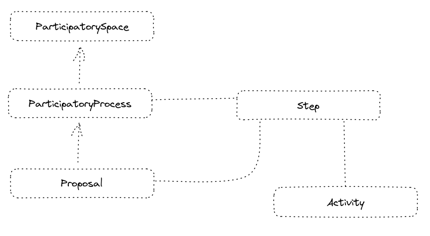

# Participatory Processes - schema draft



## TranslatedThing
```
inLanguage: Language | Text
availableLanguages: Language[] | Text
machineTranslated: Boolean
```

## ParticipatorySpace

```
identifier: PropertyValue | Text | URL
since: Date
owner: AdministrativeArea
schedule: Schedule
cumulativeBudget: MonetaryAmount
```

## ParticipatoryProcess < TranslatedThing

```
identifier: PropertyValue | Text | URL
name: Text
description: Text
topics: DefinedTerm[]
definition: Step[]
budget: MonetaryAmount
start: Date
end: Date
currentStep: Step
participatorySpace: ParticipatorySpace
availableAction: FollowAction
```

## Step < TranslatedThing

```
identifier: PropertyValue | Text | URL
name: Text
start: Date
end: Date
constraints: Text
possibleActivities: Activity[]
```

## Proposal < TranslatedThing

```
identifier: PropertyValue | Text | URL
author: Person | Organization
title: Text
description: Text
topics: DefinedTerm
affected: AdministrativeArea or Place
proposedBudget: MonetaryAmount
approvedBudget: MonetaryAmount
Scope: Text
participatoryProcess: ParticipatoryProcess
ancestors: Proposal[]
successors: Proposal[]
activities: Activity[]
availableActions: VoteAction | DelegateVoteAction | CommentAction | ShareAction | FollowAction
```

## VoteAction < Action
```
voteType: Text 
```

## DelegateVoteAction < Action
```
availableRepresentants: Person[] | Organization[]
```

## FollowAction < Action

## CommentAction < Action

## ShareAction < Action

---

## Activity
```
identifier: PropertyValue | Text | URL
actor: Person | Organization
do: ActivityVerb
actsOn: Thing
at: DateTime
```

### ActivityVerb

```
Submit
Retract
Amend
Merge
Split
Cancel
ChangeBudget
VoteInFavour
VoteAgainst
StartImplementation
ImplementSuccessfully
ImplementPartlySuccessfully
ImplementUnsuccessfully
AbortImplementation
```
